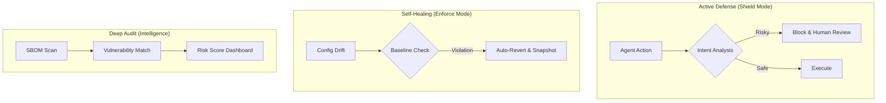

# 🛡️ OpenClaw Guardrails

<p align="center">
  <a href="README.md">English</a> | <a href="README.zh-CN.md">简体中文</a>
</p>

<p align="center">
  
  
  
  
</p>

---

**OpenClaw Guardrails** is a **full-stack security protection and self-healing framework** designed for AI Agents. Acting as the "Immune System" for the OpenClaw ecosystem, it ensures your AI assistants operate within safe boundaries through real-time semantic interception, configuration enforcement, and deep supply-chain scanning.

---

## 🚀 Quick Start: AI-Native Installation

If you are using **OpenClaw**, leverage its intelligence to deploy a full enterprise-grade defense system. Just say to your Agent:

> **"Help me install `lttcnly/openclaw-guardrails`. Once installed, initialize the security baseline, set up a daily automated audit at 03:17, and show me the first risk-score report."**

---

## 🏗️ System Architecture: Three-Pillar Defense

Guardrails builds a closed-loop of **Monitor -> Decide -> Heal**:

1.  **Shield Layer (Active Defense)**: Intercepts high-risk intents (transfers, deletions) and redacts sensitive info.
2.  **Enforce Layer (Self-Healing)**: Forcibly reverts illegal config drifts based on a "Golden Baseline."
3.  **Audit Layer (Intelligence)**: Performs quad-intelligence correlation scans to identify supply-chain vulnerabilities.



---

## 🔥 Enterprise Features

### 💎 1. Financial-Grade Shield
The only framework capable of understanding Agent intent at a semantic level:
-   **Semantic Recognition**: Identifies hidden intents like `transfer`, `pay`, or `withdraw` in natural language.
-   **Circuit Breaker**: Instantly cuts tool execution flows when risk is detected and requests admin approval.
-   **Context Awareness**: Distinguishes between legitimate queries and unauthorized asset movement.

### 🩹 2. Golden Baseline Enforcement
Eliminates security gaps caused by "permission drift":
-   **Strict Guarding**: Enforces core settings like `authMode: token` and `systemRunApproval: always`.
-   **Instant Reversion**: Auto-restores configurations within milliseconds of detecting a violation (e.g., `allowInsecure: true`).
-   **Snapshot Audit**: Maintains timestamped snapshots in `backups/` for forensic investigations.

### 🕵️ 3. PII & Credential Sanitizer
Ensures your API Keys don't become "public secrets":
-   **Full-Spectrum Probe**: Scans `.env`, `.log`, and `.json` for keys, emails, IPs, and tokens.
-   **Auto-Redaction**: Reports automatically replace sensitive data with `[REDACTED]` tokens.

### 🔍 4. Supply Chain Loop (SBOM & Vuln)
Deep inspection into the Skill ecosystem:
-   **Asset Inventory (SBOM)**: Generates standard Software Bill of Materials for all Skills and their transitive dependencies.
-   **Intelligence Sync**: Correlates findings with **CNVD**, **NVD**, **OSV**, and **GitHub Advisory**.

---

## 📋 Compliance & Governance

Guardrails helps organizations meet global cybersecurity standards:
-   ✅ **MLPS 2.0 (China)**: Identity, Access Control, Security Audit, Data Integrity.
-   ✅ **CIS Benchmarks**: OS and service hardening checks.
-   ✅ **GDPR**: Automatic privacy data identification and redaction.

---

## 🛠️ Performance Benchmarks

| Metric | Result | Description |
| :--- | :--- | :--- |
| **Full Audit Duration** | < 15s | Powered by Python multi-processing engine. |
| **Self-Healing Latency** | < 100ms | Detection-to-reversion speed for critical drifts. |
| **Memory Footprint** | ~50MB | Lightweight design; zero impact on OpenClaw performance. |
| **Scanning Depth** | 5 Levels | Deeply identifies nested npm/pip shadow dependencies. |

---

## 📖 Advanced Configuration: `guardrails.yaml`

Customize your defense policies with ease:
```yaml
policies:
  financial_protection:
    enabled: true
    threshold: 0.8  # Confidence for risk intent
  config_baseline:
    strict_mode: true
    protected_keys: ["authMode", "groupPolicy"]
  retention:
    reports_days: 30 # Auto-cleanup artifacts older than 30 days
```

---

## 🤝 Community & Roadmap
- [x] v1.1 Parallel Engine & Configuration Enforcement
- [x] Financial-grade Semantic Interception & PII Redaction
- [ ] **Federated Protection**: Federated security audits across multiple OpenClaw nodes.
- [ ] **Behavioral Profiling**: ML-based recognition of anomalous operation sequences.

---

**🛡️ Bulletproof your AI Agents. Guardrails is your first and last line of defense.**
