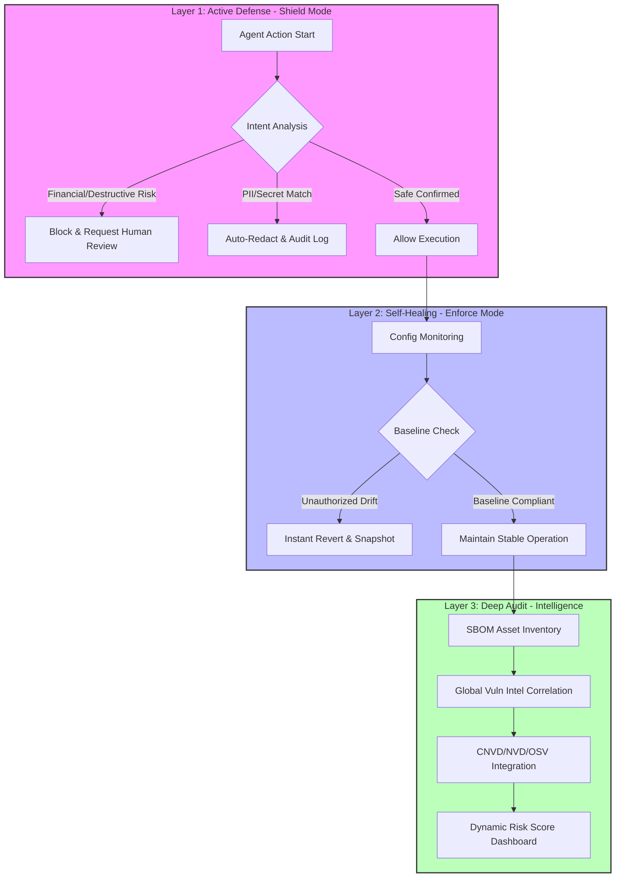

# 🛡️ OpenClaw Guardrails

<p align="center">
  <a href="README.md">English</a> | <a href="README.zh-CN.md">简体中文</a>
</p>

<p align="center">
  
  
  
  
</p>

---

**OpenClaw Guardrails** is a **full-stack security protection and self-healing framework** designed for AI Agents.

In the Multi-Agent era, AI assistants possess powerful privileges: executing shell scripts, managing sensitive files, and calling financial APIs. Acting as the "Immune System" for the OpenClaw ecosystem, Guardrails provides a three-pillar defense architecture (Active Interception, Self-Healing, and Deep Scanning) to ensure your AI systems operate strictly within safe boundaries, cutting off prompt injections, asset exfiltration, and supply-chain attacks at the source.

---

## 🚀 Quick Start: AI-Native Installation

If you are using **OpenClaw**, leverage its intelligence to deploy a full enterprise-grade defense system in seconds. Just say to your Agent:

> **"Help me install `lttcnly/openclaw-guardrails`. Once installed, initialize the security baseline, set up a daily automated audit at 03:17, and show me the first risk-score report."**

---

## 🏗️ System Architecture: Three-Pillar Defense (Vertical Flow)

Guardrails is more than a scanner; it builds a complete closed-loop from **Real-time Interception to Auto-Reversion**:



---

## 🔥 Core Capability Deep-Dive

### 💎 1. Financial-Grade Shield & Intent Analysis (`threat_intel.py`)
The "Brain" of Guardrails, capable of understanding the semantic intent behind Agent tool calls:
-   **Financial Circuit Breaker**: Real-time identification of intents like `transfer`, `pay`, or `withdraw` hidden in natural language, requiring mandatory human approval.
-   **Destructive Command Lockdown**: Blocks catastrophic operations like `rm -rf /`, `chmod 777`, or `mkfs`.
-   **Exfiltration Monitoring**: Detects suspicious `curl` uploads, `scp` transfers, and unauthorized reverse shells (`bash -i`).

### 🩹 2. Security Baseline Enforcement & Self-Healing (`auto_fix.py`)
Eliminates security gaps caused by "permission drift" or human error:
-   **Golden Baseline**: Enforces core settings like `authMode: token` (disabling anonymous access) and `systemRunApproval: always`.
-   **Self-Healing Reversion**: Instantly restores configurations (e.g., `allowInsecure: true`) within milliseconds of detecting a violation.
-   **Snapshot Auditing**: Maintains timestamped snapshots in `backups/` for every remediation, ensuring full forensic traceability.

### 🕵️ 3. Privacy Protection & PII Sanitizer (`sanitizer.py`)
Ensures your API Keys and private data don't become "public secrets":
-   **Deep Probing**: Scans `.env`, `.log`, `.json`, and `.yaml` files for keys, emails, IPs, JWT tokens, and passwords.
-   **Automated Redaction**: Automatically replaces sensitive info with `<REDACTED>` in all audit reports and logs.

### 🔍 4. Supply Chain & SBOM Loop (`sbom.py` / `vuln_scan.py`)
Deep-tissue inspection of the Skill ecosystem:
-   **SBOM Inventory**: Generates standard Software Bill of Materials for all installed Skills and their transitive npm/pip dependencies.
-   **Quad-Intelligence Sync**: Real-time correlation with **CNVD**, **NVD**, **OSV**, and **GitHub Advisory**.
-   **Zero-Trust Verification**: Uses cryptographic hashing (`hash_pin.py`) to ensure Skill code remains untampered.

---

## 📖 Advanced Configuration: `guardrails.yaml`

As a mature product, Guardrails offers fine-grained control:
```yaml
policies:
  # Financial Protection Policy
  financial_protection:
    enabled: true
    threshold: 0.8  # Confidence for intent recognition
    blocked_keywords: ["transfer", "wallet", "blockchain"]
  
  # Golden Baseline Enforcement
  config_baseline:
    strict_mode: true
    protected_keys: 
      - "authMode"
      - "groupPolicy"
      - "systemRunApproval"
      - "allowInsecure"
  
  # Sanitization Settings
  sanitization:
    auto_redact: true
    sensitive_patterns: ["API_KEY", "JWT_TOKEN", "SSH_KEY"]

  # Lifecycle Management
  retention:
    reports_days: 30 # Auto-cleanup artifacts older than 30 days
```

---

## 📋 Compliance & Governance

Guardrails helps organizations meet global cybersecurity standards:
-   ✅ **MLPS 2.0 (China)**: Identity, Access Control, Security Audit, Data Integrity.
-   ✅ **CIS Benchmarks**: OS and service hardening checks.
-   ✅ **GDPR**: Automatic privacy data identification and redaction.

---

## 🛠️ Performance Benchmarks

| Metric | Result | Description |
| :--- | :--- | :--- |
| **Audit Duration** | < 15s | Powered by Python multi-processing engine. |
| **Baseline Latency** | Near-real-time | Millisecond response to critical config drifts. |
| **Memory Footprint** | ~50MB | Lightweight; zero impact on OpenClaw performance. |
| **Scanning Depth** | 5 Levels | Deeply identifies nested shadow dependencies. |

---

## 💡 Call for Contributions & Algorithms (Join Us!)

**Security is a game of wits, but it's won through collaboration.**  
We warmly welcome security experts and developers to contribute better algorithms for intent recognition, self-healing, or zero-trust auditing. If you have any suggestions, feel free to open an **Issue** or submit a **Pull Request**. Let's build a safer AI future together!

---

## 🤝 Roadmap
- [x] v1.1 Parallel Engine & Configuration Enforcement
- [x] Financial-grade Semantic Interception & PII Redaction
- [ ] **Federated Protection**: Global situational awareness across multiple nodes.
- [ ] **Behavioral Profiling**: ML-based recognition of anomalous operation sequences.

---

**🛡️ Bulletproof your AI Agents. Guardrails is your first and last line of defense.**
