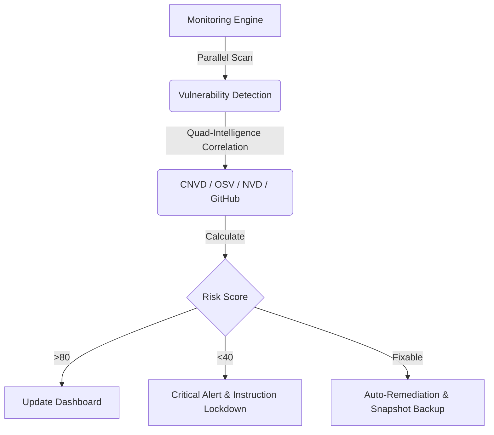

# 🛡️ OpenClaw Guardrails

  <a href="README.md">English</a> | <a href="README.zh-CN.md">简体中文</a>

**The ultimate "Immune System" & Self-Healing framework for your AI Agents.**  
OpenClaw Guardrails is the first **"Self-Healing Security Framework"** designed for the Multi-Agent era. It doesn't just find problems—it **automatically fixes** vulnerabilities before they can be exploited.

---

## 🚀 One-Click Intelligence (AI-Native Installation)

If you are already running **OpenClaw**, you can leverage its intelligence to set up this entire defense system in seconds. Just say:

> **"Help me install the GitHub project `lttcnly/openclaw-guardrails`. Once installed, initialize the security baseline, set up the daily automated scan, and show me the first security report."**

---

## 🏗️ Operational Logic: The Security Loop

Guardrails creates a complete closed-loop security cycle through parallel scanning, intelligence correlation, and automated response:

---

## 💎 Core Benefits: Why Every OpenClaw User Needs Guardrails

1.  **🚀 Extreme Performance**: Powered by a parallel scanning engine, completing a deep audit of the entire OS and Skill ecosystem in seconds.
2.  **🧠 Self-Healing AI**: Beyond simple reporting—Guardrails **automatically fixes** unsafe configurations and upgrades vulnerable dependencies.
3.  **🩹 Security Baseline Guard**: Defines a "Golden Baseline". Any unauthorized modification of critical settings (like `authMode`) will be forcibly reverted.
4.  **💰 Financial-Grade Shield**: Real-time semantic analysis to intercept AI-triggered **transfers**, **payments**, and **wallet** operations.
5.  **📡 Global Intelligence**: Deeply integrated with **CNVD**, **Google OSV**, **NIST NVD**, and **GitHub Advisory** global vulnerability databases.

---

## 🔥 Feature Deep-Dive

### 🛡️ 1. Active Defense & Baseline Self-Healing (`auto_fix.py`)
-   **Golden Baseline Enforcement**: Strictly monitors `openclaw.json`. If `authMode` is downgraded or `systemRunApproval` is disabled, Guardrails instantly restores the secure state.
-   **Config Realignment**: Automatically fixes unsafe settings (e.g., `groupPolicy="open"`) and creates timestamped snapshots in `backups/` before remediation.

### 🕵️ 2. Deep Inspection & PII Sanitization (`sanitizer.py` / `vuln_scan.py`)
-   **PII & Credential Sanitization**: Automatically identifies and redacts API Keys, Emails, Tokens, and IP addresses in logs and configs to prevent privacy leaks.
-   **Supply Chain Vuln Loop**: `vuln_scan.py` directly consumes `sbom.json` for an automated "asset discovery" to "vulnerability matching" pipeline.

### 🛡️ 3. Shield Mode (Real-time Interception) (`threat_intel.py`)
-   **Financial Transaction Interception**: Real-time detection and blocking of high-risk tool call intents like transfer, pay, and withdraw.
-   **Destructive Instruction Lockdown**: Hard-blocks `rm -rf /` or `chmod 777` at the gateway layer.
-   **Exfiltration Monitoring**: Monitors for suspicious `curl` uploads, `scp`, and reverse shell patterns (`bash -i`).

### 📋 4. Asset Governance & Compliance (`sbom.py` / `compliance_check.py`)
-   **SBOM (Software Bill of Materials)**: Generates a full inventory of components, enabling rapid response to zero-day events.
-   **Regulatory Compliance**: Pre-configured checks for international and regional cybersecurity standards (e.g., MLPS 2.0).
-   **Config Drift Monitoring**: Tracks every change in `openclaw.json` with detailed audit logs.

### 📊 5. Situational Awareness (`risk_score.py` / `html_dashboard.py`)
-   **Dynamic Risk Scoring**: Translates complex security metrics into a simple 0-100 score.
-   **Trend Analysis Dashboard**: Generates beautiful HTML reports with **10-day risk trends**.

---

## 🛠️ Engineering Highlights
*   **Parallel Execution**: Multi-process execution for zero-wait audits.
*   **Data Redaction**: Automatically redacts sensitive information from all reports before saving.
*   **Automated Lifecycle**: Auto-cleanup of redundant artifacts to save disk space.

---

## 🤝 Contributing
We welcome security researchers and developers to submit new policies or optimize scoring algorithms.

**🛡️ Bulletproof your AI agents. Guardrails is your first and last line of defense.**
