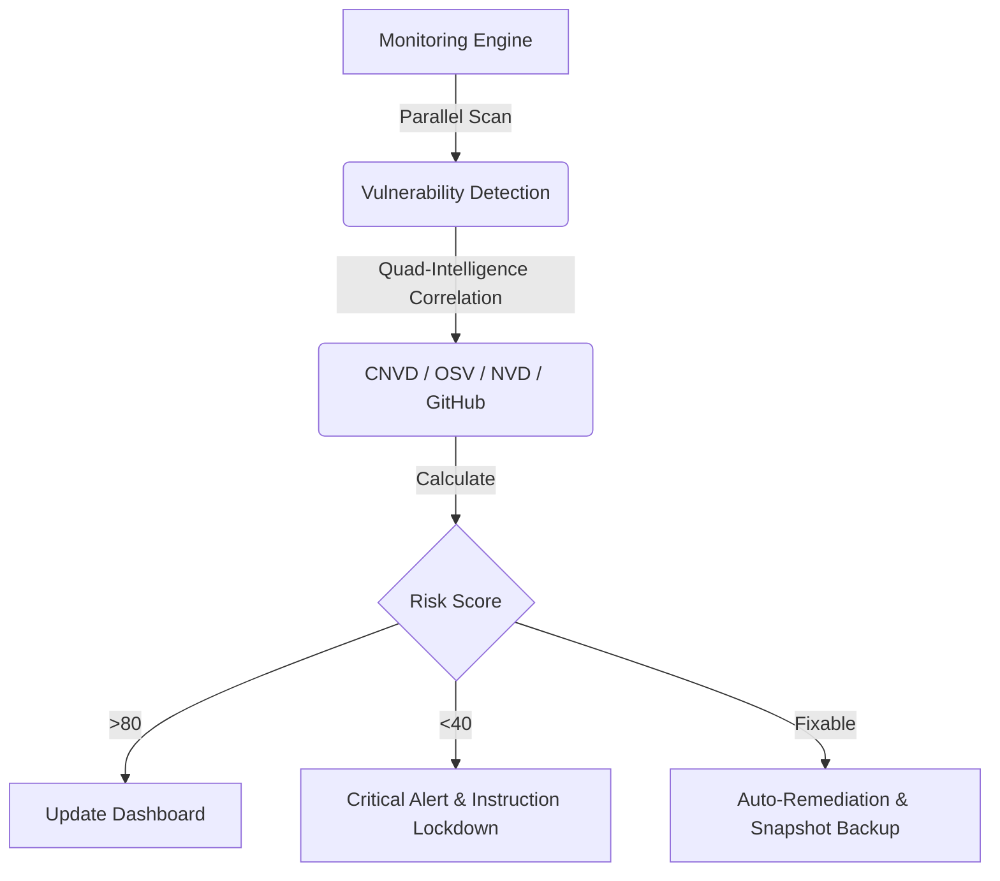

# 🛡️ OpenClaw Guardrails

  <a href="README.md">English</a> | <a href="README.zh-CN.md">简体中文</a>

**The ultimate "Immune System" & Self-Healing framework for your AI Agents.**  
OpenClaw Guardrails is the first **"Self-Healing Security Framework"** designed for the Multi-Agent era. It doesn't just find problems—it **automatically fixes** vulnerabilities before they can be exploited.

---

## 🚀 One-Click Intelligence (AI-Native Installation)

If you are already running **OpenClaw**, you can leverage its intelligence to set up this entire defense system in seconds. Just say:

> **"Help me install the GitHub project `lttcnly/openclaw-guardrails`. Once installed, initialize the security baseline, set up the daily automated scan, and show me the first security report."**

---

## 🏗️ Operational Logic: The Security Loop

Guardrails creates a complete closed-loop security cycle through parallel scanning, intelligence correlation, and automated response:

---

## 💎 Core Benefits: Why Every OpenClaw User Needs Guardrails

1.  **🚀 Extreme Performance**: Powered by a parallel scanning engine, completing a deep audit of the entire OS and Skill ecosystem in seconds.
2.  **🧠 Self-Healing AI**: Beyond simple reporting—Guardrails **automatically fixes** unsafe configurations and upgrades vulnerable dependencies.
3.  **💰 Financial-Grade Shield**: The only framework capable of real-time interception of AI-triggered **transfers**, **payments**, and **wallet** operations requiring human approval.
4.  **📡 Global Vulnerability Intelligence**: Deeply integrated with **CNVD**, **Google OSV**, **NIST NVD**, and **GitHub Advisory** global vulnerability databases.

---

## 🔥 Feature Deep-Dive

### 🕵️ 1. "Quad-Intelligence" Vulnerability Management (`vuln_scan.py`)
Our engine performs deep scans using four authoritative intelligence sources:
-   **CNVD Integration**: Specialized audits against the China National Vulnerability Database.
-   **Global Intelligence Sync**: Real-time cross-referencing with major global vulnerability databases.
-   **Shadow Dependency Discovery**: Recursive parsing of `package.json` and `requirements.txt` to find hidden supply-chain risks.

### 🩹 2. "Active Defense" Auto-Remediation (`auto_fix.py`)
Stop manually tracking security logs. Guardrails acts as your automated Security SRE:
-   **Config Realignment**: Instantly closes unsafe settings (e.g., `groupPolicy="open"`) and corrects over-privileged policies.
-   **Snapshot Backups**: Creates a timestamped snapshot in `backups/` before every fix, ensuring one-click rollback.

### 🛡️ 3. Shield Mode (Real-time Governance & Interception)
Protects your assets from accidental or malicious AI behaviors:
-   **Financial Interception**: Real-time blocking of transfers, payments, and wallet operations to prevent AI from being induced into unauthorized asset movement.
-   **Destructive Instruction Lockdown**: Hard-blocking of `rm -rf /` or `chmod 777` at the gateway layer.

### 📋 4. Enterprise Compliance & Asset Governance (`sbom.py` / `compliance_check.py`)
-   **SBOM (Software Bill of Materials)**: Generates a full inventory of components, enabling second-level location of "Log4j-style" vulnerabilities.
-   **Regulatory Compliance**: Pre-configured checks for regional cybersecurity standards (like MLPS 2.0).
-   **Config Drift Monitoring**: Tracks every change in `openclaw.json`. Know exactly *who* changed *what* and *when*.

### 📊 5. Situational Awareness & Visualization (`risk_score.py` / `html_dashboard.py`)
-   **Dynamic Risk Scoring**: Translates complex security metrics into a simple 0-100 score.
-   **Trend Analysis Dashboard**: Generates beautiful HTML reports with **10-day risk trends**.

---

## 🛠️ Engineering Highlights
*   **Parallel Scanning**: Multi-process execution for zero-wait audits.
*   **Data Redaction**: Automatically redacts PII and sensitive tokens from all reports.
*   **Lifecycle Management**: Automated cleanup of old audit artifacts.

---

## 📖 Roadmap
- [x] Parallel Scanning & Quad-Intelligence Integration
- [x] Risk Scoring & Trend Dashboard
- [x] Auto-fix Remediation
- [ ] **Cloud Sync**: Baseline synchronization across multiple nodes.
- [ ] **ML Anomaly Detection**: Identifying suspicious prompt patterns with local models.

---

## 🤝 Contributing
We welcome security researchers and developers to submit new policies or optimize scoring algorithms.

**🛡️ Bulletproof your AI agents. Guardrails is your first and last line of defense.**
