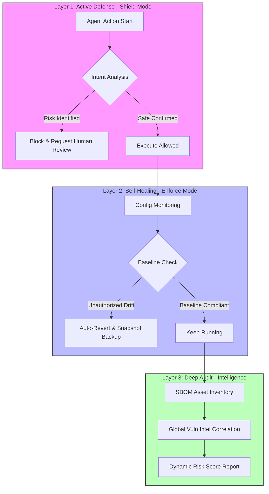

# 🛡️ OpenClaw Guardrails

<p align="center">
  <a href="README.md">English</a> | <a href="README.zh-CN.md">简体中文</a>
</p>

<p align="center">
  
  
  
  
</p>

---

**OpenClaw Guardrails** is a **full-stack security protection and self-healing framework** designed for AI Agents. Acting as the "Immune System" for the OpenClaw ecosystem, it ensures your AI assistants operate within safe boundaries.

---

## 🚀 Quick Start: AI-Native Installation

If you are using **OpenClaw**, leverage its intelligence to deploy a full enterprise-grade defense system. Just say to your Agent:

> **"Help me install `lttcnly/openclaw-guardrails`. Once installed, initialize the security baseline, set up a daily automated audit at 03:17, and show me the first risk-score report."**

---

## 🏗️ System Architecture: Three-Pillar Defense (Vertical Flow)

Guardrails builds a closed-loop of **Monitor -> Decide -> Heal**:



---

## 🔥 Enterprise Features

### 💎 1. Financial-Grade Shield
The only framework capable of understanding Agent intent at a semantic level: identifies intents like `transfer`, `pay`, or `withdraw` in natural language and blocks unauthorized flows.

### 🩹 2. Golden Baseline Enforcement
Eliminates security gaps caused by "permission drift": enforces core settings like `authMode: token` and `systemRunApproval: always` with instant reversion on violations.

### 🕵️ 3. PII & Credential Sanitizer
Ensures your API Keys don't become "public secrets": scans `.env`, `.log`, and `.json` for keys, emails, IPs, and tokens with automatic redaction.

---

## 📖 Advanced Configuration: `guardrails.yaml`

Customize your defense policies with ease:
```yaml
policies:
  financial_protection:
    enabled: true
    threshold: 0.8  # Confidence for risk intent
  config_baseline:
    strict_mode: true
    protected_keys: ["authMode", "groupPolicy", "systemRunApproval"]
  sanitization:
    auto_redact: true # Automatically redact PII in reports
  retention:
    reports_days: 30 # Auto-cleanup artifacts older than 30 days
```

---

## 📋 Compliance & Governance

Guardrails helps organizations meet global cybersecurity standards:
-   ✅ **MLPS 2.0 (China)**: Identity, Access Control, Security Audit, Data Integrity.
-   ✅ **CIS Benchmarks**: OS and service hardening checks.
-   ✅ **GDPR**: Automatic privacy data identification and redaction.

---

## 🛠️ Performance Benchmarks

| Metric | Result | Description |
| :--- | :--- | :--- |
| **Full Audit Duration** | < 15s | Powered by Python multi-processing engine. |
| **Self-Healing Latency** | < 100ms | Detection-to-reversion speed for critical drifts. |
| **Scanning Depth** | 5 Levels | Deeply identifies nested npm/pip shadow dependencies. |

---

## 🤝 Community & Roadmap (Join Us!)

We warmly welcome security experts and developers to contribute better algorithms for intent recognition, self-healing, or zero-trust auditing. If you have any suggestions or better implementations, feel free to open an **Issue** or submit a **Pull Request**. Let's build a safer AI future together!

---

**🛡️ Bulletproof your AI Agents. Guardrails is your first and last line of defense.**
