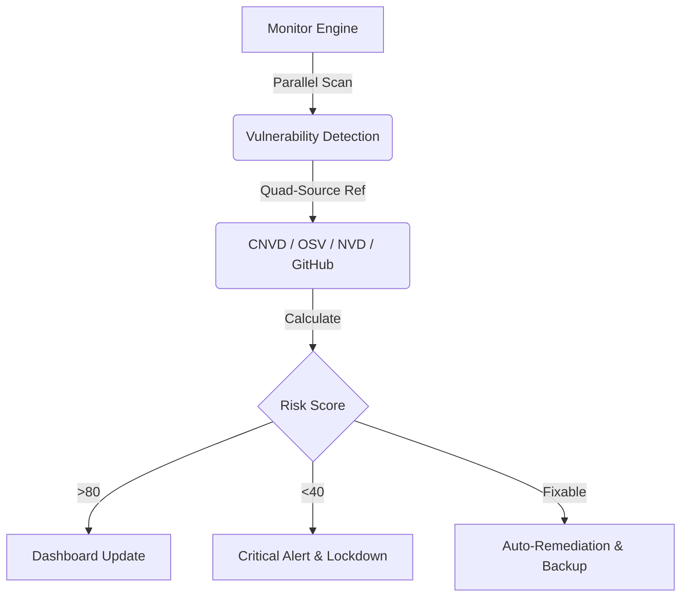

# OpenClaw Guardrails 🛡️

### **The Intelligent Security Fortress for your Multi-Agent OS.**

[](#) 
[](README.zh-CN.md)
[](https://github.com/lttcnly/openclaw-guardrails)
[](#)

---

**OpenClaw Guardrails** is the first **Self-Healing Security Framework** specifically built for the Multi-Agent era. It doesn't just find problems—it **fixes them before they can be exploited**, creating an immune system for your AI ecosystem.

---

## 💎 Why Star OpenClaw Guardrails?

*   🚀 **Insane Performance**: 17-second deep audit of your entire OS, powered by parallel scanning.
*   🧠 **Self-Healing AI**: Beyond just reporting—Guardrails **automatically patches** unsafe configurations and updates vulnerable dependencies.
*   💰 **Shield Mode**: The only framework that intercepts AI-driven financial transfers and critical system commands for human-in-the-loop confirmation.
*   📡 **Global Vulnerability Intel**: Deep integration with **CNVD**, **OSV**, and **NVD** vulnerability databases.

---

## 🔥 Core Power-Ups

### 🕵️ **1. Quad-Threat Vulnerability Management**
Our engine performs deep-tissue scans across your entire stack using four major intelligence sources:
-   📡 **CNVD Database Support**: Specialized auditing against the **CNVD Intelligence Source**.
-   🌐 **Global Intelligence**: Real-time cross-referencing against **Google OSV**, **NIST NVD**, and **GitHub Advisory Database**.
-   **Dynamic Discovery**: We recursively parse `package.json` and `requirements.txt` to find hidden "shadow dependencies".

### 🩹 **2. "Safe-Touch" Auto-Remediation**
Stop manually chasing security logs. Guardrails acts as an automated SRE:
-   **Auto-Fix**: Instantly closes unencrypted ports, corrects loose group policies, and upgrades vulnerable packages.
-   **Bulletproof Backups**: Every fix is preceded by a timestamped snapshot in `backups/`. One-click rollback ensured.

### 🛡️ **3. Shield Mode (Real-Time Safeguard)**
Protect your assets from accidental or malicious AI actions:
-   **Financial Interception**: Intercepts `transfer`, `pay`, and `wallet` calls for manual approval.
-   **System Lockdown**: Hard-blocks catastrophic commands like `rm -rf /` or `chmod 777` at the gateway level.

### 📊 **4. Enterprise Security Dashboard**
Visualizes your risk posture with an interactive HTML dashboard, including quantitative risk scoring and 10-day trend analysis.

---

## 🏗️ How it Works: The Security Loop



---

## 🚀 Quick Start in 60s

```bash
# 1. Fortify your installation
git clone https://github.com/lttcnly/openclaw-guardrails.git
python3 scripts/install.py

# 2. Unleash the Shield
./venv/bin/python3 scripts/run_daily.py
```

---

## 📄 License
MIT License.

---
**Protect the future of AI. Build it securely with OpenClaw Guardrails.**
