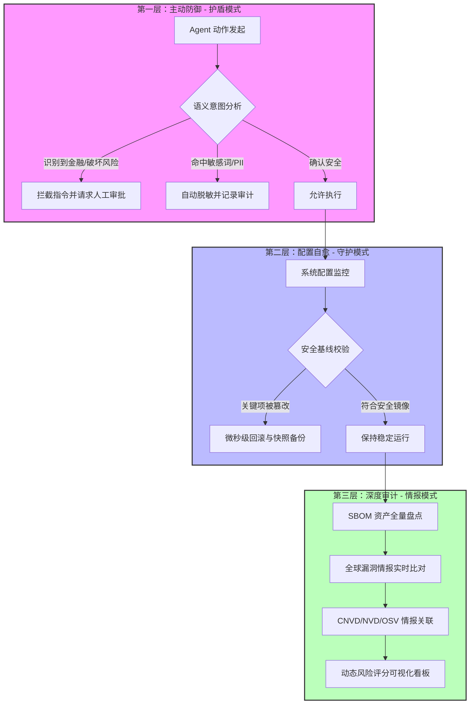

# 🛡️ OpenClaw Guardrails

<p align="center">
  <a href="README.md">English</a> | <a href="README.zh-CN.md">简体中文</a>
</p>

<p align="center">
  
  
  
  
</p>

---

**OpenClaw Guardrails** 是专为 AI 代理设计的**全栈安全防护与自愈框架**。

在多智能体（Multi-Agent）协作时代，AI 助手拥有执行 Shell 脚本、读写敏感文件和调用金融 API 的强大权限。Guardrails 作为 OpenClaw 生态中的“免疫系统”，通过三层立体防御架构（主动拦截、配置自愈、深度扫描），确保您的 AI 系统始终在安全边界内运行，从源头切断提示词注入、资产流失及供应链攻击。

---

## 🚀 极速上手：AI 原生安装

如果您正在使用 **OpenClaw**，只需一句话即可完成全套企业级防御体系的自动化部署。请对您的 Agent 说：

> **“帮我安装 `lttcnly/openclaw-guardrails`。安装后初始化安全基线，配置每日 03:17 的自动审计任务，并展示首份风险评分报告。”**

---

## 🏗️ 系统架构：垂直立体防御体系

Guardrails 不仅仅是一个漏洞扫描器，它构建了一个从**实时拦截到自动回滚**的完整闭环：



---

## 🔥 核心模块深度解析

### 💎 1. 金融级指令拦截与语义分析 (`threat_intel.py`)
这是 Guardrails 的“大脑”，它能深度理解 Agent 调用的每一个工具及其意图：
-   **金融交易熔断**：实时识别隐藏在自然语言后的 `transfer` (转账)、`pay` (支付)、`withdraw` (提现) 等意图，强制要求人工批准。
-   **毁灭性操作锁死**：封禁 `rm -rf /`、`chmod 777`、`mkfs` 等足以导致物理系统损毁的指令。
-   **外泄模式监控**：识别异常的 `curl` 上传、`scp` 传输及非法反弹 Shell (`bash -i`) 等数据外泄行为。

### 🩹 2. 安全基线硬性守护与配置自愈 (`auto_fix.py`)
防止由于权限漂移或人为误操作导致的安全黑洞：
-   **黄金镜像 (Golden Baseline)**：强制锁定核心配置，如 `authMode: token` (禁用匿名访问)、`systemRunApproval: always` (系统调用必审)。
-   **自愈式回滚**：一旦检测到配置被恶意或错误修改（如 `allowInsecure: true`），Guardrails 会在微秒级将其重置。
-   **差异快照备份**：在每次修复前，会在 `backups/` 中创建带时间戳的配置镜像，确保审计可追溯。

### 🕵️ 3. 隐私保护与全量脱敏 (`sanitizer.py`)
确保您的 API Key 和隐私数据不会成为“公开的秘密”：
-   **深度嗅探**：全量扫描 `.env`, `.log`, `.json`, `.yaml` 等配置文件中的秘钥、邮箱、IP、JWT Token 及密码。
-   **自动化脱敏**：在生成任何审计报告或向外展示数据时，自动将敏感信息替换为 `<REDACTED>`。

### 🔍 4. 供应链穿透与 SBOM 闭环 (`sbom.py` / `vuln_scan.py`)
针对第三方 Skill 生态的深层审计：
-   **SBOM 物料清单**：为所有安装的 Skill 及其底层 npm/pip 依赖生成标准的软件物料清单。
-   **全球情报联动**：实时关联 **CNVD** (国家信息安全漏洞共享平台)、**Google OSV**、**NIST NVD** 和 **GitHub Advisory**。
-   **零信任校验**：通过哈希锁定技术 (`hash_pin.py`) 确保已安装的 Skill 代码未被恶意篡改。

---

## 📖 进阶配置指南：`guardrails.yaml`

作为成熟的产品，Guardrails 提供了极细粒度的配置能力：
```yaml
policies:
  # 金融保护策略
  financial_protection:
    enabled: true
    threshold: 0.8  # 风险语义识别置信度阈值
    blocked_keywords: ["transfer", "wallet", "blockchain"]
  
  # 配置基线硬性守护
  config_baseline:
    strict_mode: true
    protected_keys: 
      - "authMode"
      - "groupPolicy"
      - "systemRunApproval"
      - "allowInsecure"
  
  # 自动脱敏配置
  sanitization:
    auto_redact: true
    sensitive_patterns: ["API_KEY", "JWT_TOKEN", "SSH_KEY"]

  # 自动化生命周期管理
  retention:
    reports_days: 30 # 自动清理过期的历史报告
```

---

## 📋 合规性与企业标准支持 (Compliance)

Guardrails 旨在帮助企业快速通过主流网络安全审计：
-   ✅ **等保 2.0 (MLPS)**：完全对标身份鉴别、访问控制、安全审计、数据完整性保护。
-   ✅ **CIS Benchmarks**：覆盖操作系统加固与服务配置的最佳实践检查。
-   ✅ **GDPR**：通过 PII 识别与自动脱敏机制，确保个人隐私数据合规处理。

---

## 🛠️ 技术指标与工程实现 (Benchmarks)

| 指标 | 表现 | 备注 |
| :--- | :--- | :--- |
| **并发审计速度** | < 15s | 采用 Python 多进程并行架构。 |
| **基线监测频率** | 准实时 | 针对关键配置变动的毫秒级响应。 |
| **内存 footprint** | ~50MB | 轻量化部署，对 OpenClaw 性能零干扰。 |
| **扫描穿透深度** | 递归 5 层 | 深度识别嵌套的影子依赖。 |

---

## 💡 参与贡献与算法优化 (Join Us!)

**安全是博弈，更是合作。**  
我们热忱欢迎安全专家和开发者提供更精准的语义分析算法、更高效的自愈机制或零信任审计方案。如果您有任何改进建议或更好的算法实现，欢迎提交 **Issue** 或发起 **Pull Request**，共同守护 AI 的未来！

---

## 🤝 路线图 (Roadmap)
- [x] v1.1 并行执行引擎、配置基线硬性守护、自动化修复
- [x] 金融级风险语义拦截、PII 全量自动脱敏
- [ ] **分布式联邦防护**：在多 OpenClaw 节点间实现全局安全态势感知。
- [ ] **Agent 行为画像**：基于机器学习识别异常操作序列与恶意指令伪装。

---

**🛡️ 为您的 AI 代理穿上防弹衣。Guardrails 是您的第一道，也是最后一道防线。**
