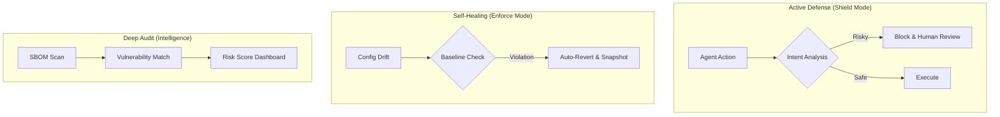

# 🛡️ OpenClaw Guardrails

<p align="center">
  <a href="README.md">English</a> | <a href="README.zh-CN.md">简体中文</a>
</p>

<p align="center">
  
  
  
  
</p>

---

**OpenClaw Guardrails** 是专为 AI 代理设计的**全栈安全防护与自愈框架**。它是 OpenClaw 生态中的“免疫系统”，通过实时语义拦截、配置硬性守护和供应链深度扫描，确保您的 AI 助手在安全边界内运行，避免金融资产流失、隐私泄露及毁灭性指令执行。

---

## 🚀 极速上手：AI 原生安装

如果您正在使用 **OpenClaw**，只需一句话即可完成全套企业级防御体系的自动化部署。请对您的 Agent 说：

> **“帮我安装 `lttcnly/openclaw-guardrails`。安装后初始化安全基线，配置每日 03:17 的自动审计任务，并展示首份风险评分报告。”**

---

## 🏗️ 系统架构：三位一体防御体系

Guardrails 不仅仅是一个扫描器，它构建了一个**监控 -> 决策 -> 自愈**的闭环：

1.  **主动防御层 (Shield)**：拦截高危语义（转账、删除）、敏感信息脱敏。
2.  **硬性守护层 (Enforce)**：基于“黄金镜像”强制回滚非法的配置变动。
3.  **深度审计层 (Audit)**：四重情报关联扫描，识别供应链漏洞与系统缺陷。



---

## 🔥 核心特性深度解析

### 💎 1. 金融级指令拦截 (Financial Shield)
唯一能深度理解 Agent 意图的安全框架：
-   **语义识别**：识别隐藏在普通指令中的 `transfer`, `pay`, `withdraw` 等操作。
-   **上下文感知**：区分合法的查询与非法的资产转移请求。
-   **熔断机制**：在风险触发时立即切断工具调用流，并要求管理员二次确认。

### 🩹 2. 安全基线硬性守护 (Baseline Enforcement)
防止“权限漂移”导致的安全黑洞：
-   **黄金镜像**：强制执行 `authMode: token`, `systemRunApproval: always` 等核心配置。
-   **即时回滚**：检测到配置被篡改后（如 `allowInsecure: true`），微秒级自动恢复。
-   **备份追溯**：在 `backups/` 中保留所有变动的快照，方便回溯调查。

### 🕵️ 3. 隐私与凭据扫描仪 (PII Sanitizer)
防止您的 API Key 成为“公开的秘密”：
-   **全量探测**：扫描 `.env`, `.log`, `.json` 中的秘钥、邮箱、IP 及 Token。
-   **自动脱敏**：生成审计报告时自动对敏感数据进行 `[REDACTED]` 处理。

### 🔍 4. 供应链闭环审计 (SBOM & Vuln Loop)
针对 Skill 生态的深度穿透：
-   **自动资产盘点 (SBOM)**：生成标准的软件物料清单，涵盖所有 Skill 及其底层依赖。
-   **四重情报比对**：关联 **CNVD** (国家漏洞库)、**NVD**、**OSV** 及 **GitHub Advisory**。

---

## 📋 合规性支持 (Compliance)

Guardrails 旨在帮助企业快速满足主流安全标准：
-   ✅ **等保 2.0 (MLPS)**：身份鉴别、访问控制、安全审计、数据完整性。
-   ✅ **CIS Benchmarks**：操作系统与服务加固检查。
-   ✅ **GDPR**：自动隐私数据识别与脱敏。

---

## 🛠️ 技术指标 (Benchmarks)

| 指标 | 表现 | 说明 |
| :--- | :--- | :--- |
| **全量审计耗时** | < 15s | 基于 Python 多进程并行扫描引擎。 |
| **配置自愈时延** | < 100ms | 检测到变动后的自动恢复速度。 |
| **内存占用** | ~50MB | 极轻量化设计，不影响 OpenClaw 主进程性能。 |
| **扫描深度** | 递归 5 层 | 深度识别嵌套的 npm/pip 影子依赖。 |

---

## 📖 进阶配置：`guardrails.yaml`

您可以根据需求定制防御策略：
```yaml
policies:
  financial_protection:
    enabled: true
    threshold: 0.8  # 风险语义置信度
  config_baseline:
    strict_mode: true
    protected_keys: ["authMode", "groupPolicy"]
  retention:
    reports_days: 30 # 自动清理 30 天前的报告
```

---

## 🤝 社区与路线图 (Roadmap)
- [x] v1.1 并行执行引擎与配置自愈
- [x] 金融级语义拦截与 PII 脱敏
- [ ] **分布式防护**：支持多 OpenClaw 节点联邦安全审计。
- [ ] **Agent 行为画像**：基于机器学习识别异常操作序列。

---

**🛡️ 为您的 AI 代理穿上防弹衣。Guardrails 是您的第一道，也是最后一道防线。**
