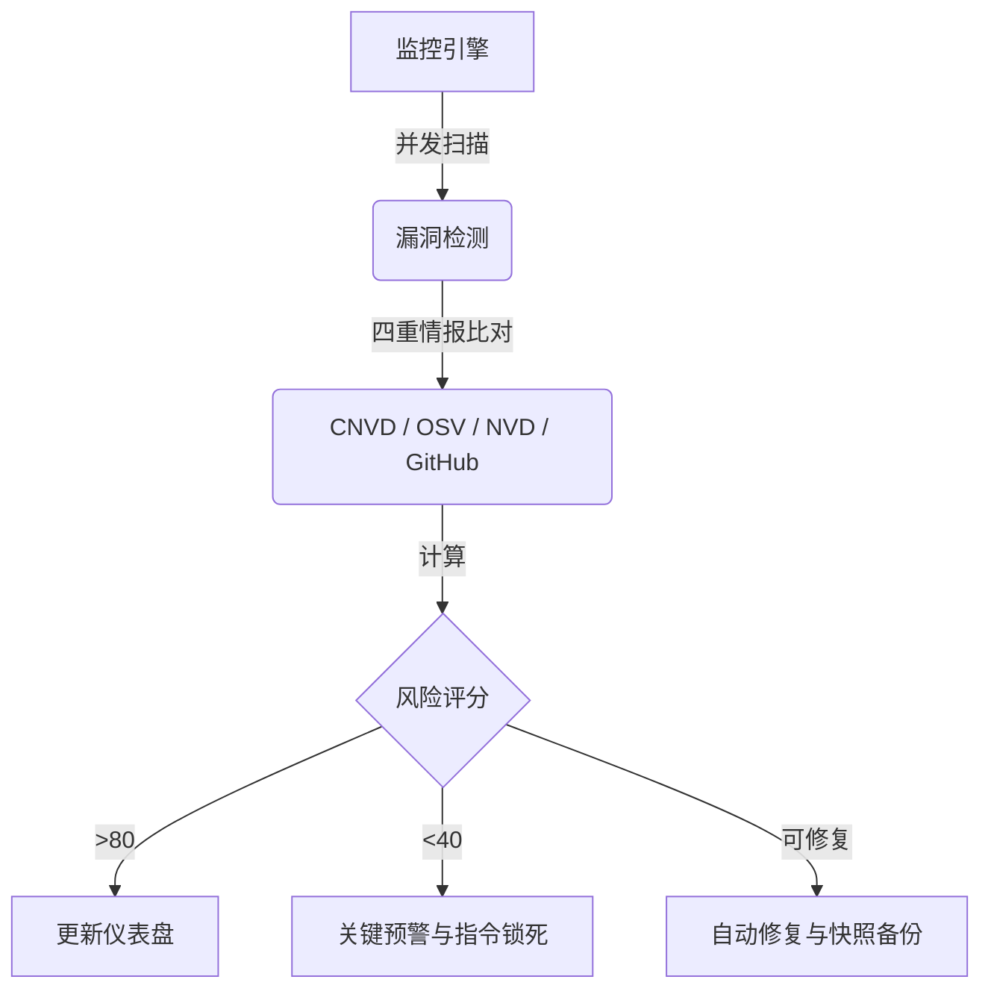

# 🛡️ OpenClaw Guardrails

  <a href="README.md">English</a> | <a href="README.zh-CN.md">简体中文</a>

**AI 代理的终极“免疫系统”与自愈框架。**  
OpenClaw Guardrails 是专为多智能体（Multi-Agent）时代打造的首个 **“自愈式安全框架”**。它不仅能深度审计风险，更能在漏洞被利用前将其 **自动化修复**，为您的 AI 生态系统构建起一道坚固的防御屏障。

---

## 🚀 一键智能安装 (AI 原生指令)

如果你正在运行 **OpenClaw**，只需一句话即可完成全套防御体系的部署。请对你的 Agent 说：

> **“帮我安装 GitHub 项目 `lttcnly/openclaw-guardrails`。安装完成后，请初始化安全基线，配置每日自动扫描任务，并展示第一次的安全审计报告。”**

---

## 🏗️ 运行逻辑：安全闭环 (Operational Logic)

本项目通过并发扫描、情报比对与自动化响应，构建了一个完整的安全闭环：

---

## 💎 核心优势：为什么选择 Guardrails？

1.  **🚀 极致性能**：基于并行扫描引擎，数秒内完成对整个 OS、Skill 及其深层依赖的深度审计。
2.  **🧠 自愈型 AI**：超越单纯的报告——Guardrails 能 **自动纠偏** 不安全配置并拦截高危指令。
3.  **🩹 强一致性守护**：定义“安全金准 (Golden Baseline)”，任何对关键安全项（如 `authMode`）的篡改都会被强制回滚。
4.  **💰 金融级护盾**：实时语义分析拦截 AI 触发的 **金融转账**、**支付** 及 **钱包** 操作。
5.  **📡 全球漏洞情报**：深度集成 **CNVD**、**Google OSV**、**NIST NVD** 和 **GitHub Advisory** 全球漏洞库。

---

## 🔥 核心能力深度解析

### 🛡️ 1. 主动防御与基线自愈 (`auto_fix.py`)
-   **安全金准守护 (Baseline Enforcement)**：硬性守护 `openclaw.json`。若 `authMode` 被降级或 `systemRunApproval` 被关闭，Guardrails 将立即强制恢复并记录审计。
-   **配置纠偏**：自动修复不安全的 `groupPolicy="open"` 设置，并在一键修复前在 `backups/` 中创建带时间戳的快照。

### 🕵️ 2. 深度检测与隐私脱敏 (`sanitizer.py` / `vuln_scan.py`)
-   **PII/凭据脱敏 (Sanitization)**：自动识别日志和配置中的 API Key、Email、Token 和 IP 地址，生成脱敏报告，防止隐私泄露。
-   **供应链漏洞闭环**：`vuln_scan.py` 直接读取 `sbom.json` 资产清单，实现从“资产发现”到“漏洞匹配”的自动化流水线。

### 🛡️ 3. 护盾模式 (实时语义拦截) (`threat_intel.py`)
-   **金融交易拦截**：实时识别并拦截转账 (transfer)、支付 (pay)、提现 (withdraw) 等高危工具调用意图。
-   **破坏性指令锁死**：在网关层级识别并硬封禁 `rm -rf /` 或 `chmod 777` 等毁灭性操作。
-   **外泄监控**：监控异常的 `curl` 上传、`scp` 及反弹 Shell (`bash -i`) 等数据外泄模式。

### 📋 4. 资产治理与合规 (`sbom.py` / `compliance_check.py`)
-   **SBOM (软件物料清单)**：为所有 Skill 生成标准组件清单。
-   **等保 2.0 合规**：预置国内网络安全等级保护检查项，助力企业级 AI 部署通过审计。
-   **配置漂移监控**：实时追踪 `openclaw.json` 的每一次细微变动。

### 📊 5. 态势感知可视化 (`risk_score.py` / `html_dashboard.py`)
-   **动态风险评分**：基于多维权重的 0-100 实时评分。
-   **趋势分析看板**：生成交互式 HTML 报告，提供 **10 天风险演变图**。

---

## 🛠️ 技术亮点
*   **并行扫描引擎**：多进程执行，全量审计无需等待。
*   **增量扫描技术**：智能识别变动，极致降低 CPU/IO 消耗。
*   **敏感信息脱敏**：报告生成过程中自动对 PII/Tokens 进行脱敏。

---

## 🤝 参与贡献
欢迎安全研究员和开发者提交新的 `guardrails.yaml` 策略或优化评分算法。

**🛡️ 为你的 AI 代理穿上防弹衣。Guardrails 是你的第一道，也是最后一道防线。**
