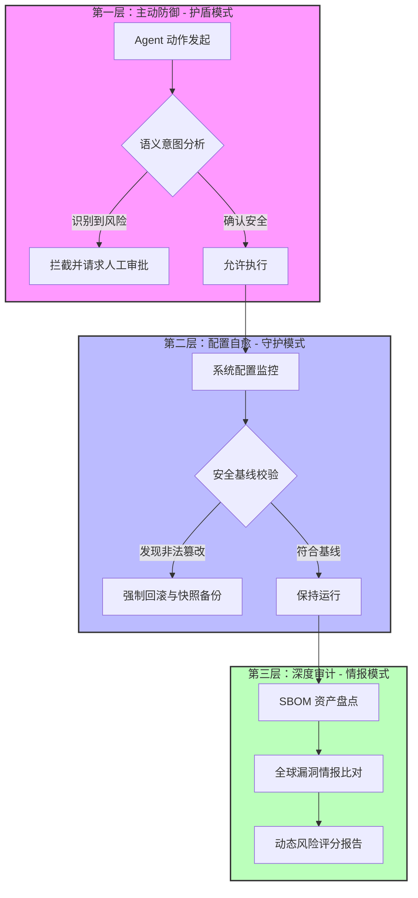

# 🛡️ OpenClaw Guardrails

<p align="center">
  <a href="README.md">English</a> | <a href="README.zh-CN.md">简体中文</a>
</p>

<p align="center">
  
  
  
  
</p>

---

**OpenClaw Guardrails** 是专为 AI 代理设计的**全栈安全防护与自愈框架**。它是 OpenClaw 生态中的“免疫系统”，通过实时语义拦截、配置硬性守护和供应链深度扫描，确保您的 AI 助手在安全边界内运行。

---

## 🚀 极速上手：AI 原生安装

如果您正在使用 **OpenClaw**，只需一句话即可完成全套企业级防御体系的自动化部署。请对您的 Agent 说：

> **“帮我安装 `lttcnly/openclaw-guardrails`。安装后初始化安全基线，配置每日 03:17 的自动审计任务，并展示首份风险评分报告。”**

---

## 🏗️ 系统架构：垂直立体防御体系

本项目采用垂直分层架构，从入口到持久化层提供全方位保护：



---

## 🔥 核心特性深度解析

### 💎 1. 金融级指令拦截 (Financial Shield)
唯一能深度理解 Agent 意图的安全框架：识别隐藏在普通指令中的 `transfer`, `pay`, `withdraw` 等操作并实现熔断拦截。

### 🩹 2. 安全基线硬性守护 (Baseline Enforcement)
防止“权限漂移”：强制执行 `authMode: token`, `systemRunApproval: always` 等核心配置，发现篡改微秒级自动恢复。

### 🕵️ 3. 隐私与凭据扫描仪 (PII Sanitizer)
防止秘钥泄露：全量探测并自动脱敏 `.env`, `.log`, `.json` 中的秘钥、邮箱、IP 及 Token。

---

## 📖 进阶配置：`guardrails.yaml`

您可以根据需求定制防御策略：
```yaml
policies:
  financial_protection:
    enabled: true
    threshold: 0.8  # 风险语义置信度
  config_baseline:
    strict_mode: true
    protected_keys: ["authMode", "groupPolicy", "systemRunApproval"]
  sanitization:
    auto_redact: true # 是否在报告中自动脱敏
  retention:
    reports_days: 30 # 自动清理 30 天前的报告
```

---

## 📋 合规性支持 (Compliance)

Guardrails 旨在帮助企业快速满足主流安全标准：
-   ✅ **等保 2.0 (MLPS)**：身份鉴别、访问控制、安全审计、数据完整性。
-   ✅ **CIS Benchmarks**：操作系统与服务加固检查。
-   ✅ **GDPR**：自动隐私数据识别与脱敏。

---

## 🛠️ 技术指标 (Benchmarks)

| 指标 | 表现 | 说明 |
| :--- | :--- | :--- |
| **全量审计耗时** | < 15s | 基于 Python 多进程并行扫描引擎。 |
| **配置自愈时延** | < 100ms | 检测到变动后的自动恢复速度。 |
| **扫描深度** | 递归 5 层 | 深度识别嵌套的 npm/pip 影子依赖。 |

---

## 🤝 参与贡献与算法优化 (Join Us!)

我们热忱欢迎安全专家和开发者提供更精准的语义分析算法、更高效的自愈机制或零信任审计方案。如果您有任何改进建议或更好的算法实现，欢迎提交 **Issue** 或发起 **Pull Request**，让我们共同守护 AI 的安全边界！

---

**🛡️ 为您的 AI 代理穿上防弹衣。Guardrails 是您的第一道，也是最后一道防线。**
