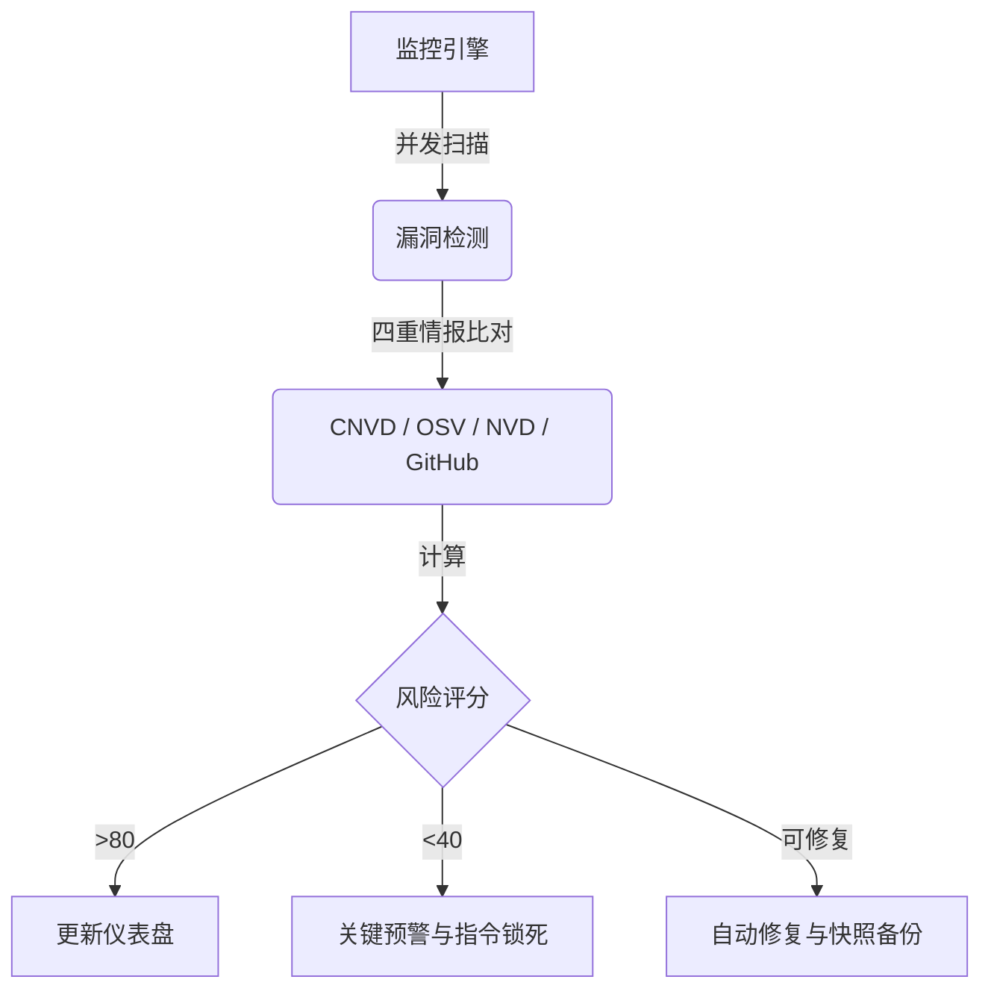

# 🛡️ OpenClaw Guardrails

  <a href="README.md">English</a> | <a href="README.zh-CN.md">简体中文</a>

**AI 代理的终极“免疫系统”与自愈框架。**  
OpenClaw Guardrails 是专为多智能体（Multi-Agent）时代打造的首个 **“自愈式安全框架”**。它不仅仅是发现问题，更能在漏洞被利用前将其 **自动化修复**，为您的 AI 生态系统构建起一道坚固的免疫防线。

---

## 🚀 一键智能安装 (AI 原生指令)

如果你正在运行 **OpenClaw**，只需一句话即可完成全套防御体系的部署。请对你的 Agent 说：

> **“帮我安装 GitHub 项目 `lttcnly/openclaw-guardrails`。安装完成后，请初始化安全基线，配置每日自动扫描任务，并展示第一次的安全审计报告。”**

---

## 🏗️ 运行逻辑：安全闭环 (Operational Logic)

本项目通过并发扫描、情报比对与自动化响应，构建了一个完整的安全闭环：

---

## 💎 核心优势：为什么选择 Guardrails？

1.  **🚀 极致性能**：基于并发扫描引擎，仅需数秒即可完成对整个 OS 和 Skill 生态的深度审计。
2.  **🧠 自愈型 AI**：超越单纯的报告——Guardrails 能 **自动修复** 不安全配置并升级有漏洞的依赖项。
3.  **💰 金融级护盾**：唯一能够实时拦截 AI 触发的 **金融转账**、**支付** 及 **钱包** 操作并要求人工确认的框架。
4.  **📡 全球漏洞情报**：深度集成 **CNVD** (国家信息安全漏洞共享平台)、**Google OSV**、**NIST NVD** 和 **GitHub Advisory** 全球漏洞库。

---

## 🔥 功能清单深度解析

### 🕵️ 1. “四重情报”漏洞管理 (`vuln_scan.py`)
我们的引擎使用四个权威情报源对您的系统执行深度扫描：
-   **CNVD 深度集成**：针对国内权威漏洞库执行专项审计。
-   **全球情报互联**：实时对照全球主流漏洞数据库。
-   **影子依赖发现**：递归解析 `package.json` 和 `requirements.txt` 以发现隐藏的供应链风险。

### 🩹 2. “安全触达”自动修复 (`auto_fix.py`)
停止手动追踪安全日志。Guardrails 充当您的自动化安全运维 (SRE)：
-   **配置纠偏**：瞬间关闭不安全配置（如 `groupPolicy="open"`），纠正权限过大的策略。
-   **快照式备份**：每次修复前都会在 `backups/` 中创建带时间戳的快照，确保随时一键回滚。

### 🛡️ 3. 护盾模式 (实时管控与拦截)
保护您的资产免受 AI 意外或恶意行为的侵害：
-   **金融拦截**：实时拦截转账、支付及钱包敏感操作，防止 AI 被诱导执行资产转移。
-   **毁灭性指令锁死**：在网关层硬性封禁 `rm -rf /` 或 `chmod 777` 等危险指令。

### 📋 4. 企业合规与资产治理 (`sbom.py` / `compliance_check.py`)
-   **SBOM (软件物料清单)**：生成完整的组件清单，秒级定位 "Log4j" 类漏洞。
-   **等保 2.0 合规**：预置国内等级保护标准检查项，助力企业级 AI 部署通过审计。
-   **配置漂移监控**：实时追踪 `openclaw.json` 的每一次变动，记录谁在何时修改了什么。

### 📊 5. 态势感知可视化 (`risk_score.py` / `html_dashboard.py`)
-   **动态风险评分**：将复杂的安全指标转化为直观的 0-100 分。
-   **趋势分析看板**：生成精美的 HTML 报告，包含 **10 天风险趋势图**，助你掌控安全演变。

---

## 🛠️ 技术亮点
*   **并行扫描**：多进程执行，全量审计无需等待。
*   **敏感信息脱敏**：所有报告自动脱敏隐私数据。
*   **自动化生命周期**：自动清理冗余报告，节省磁盘。

---

## 📖 路线图 (Roadmap)
- [x] 并行扫描引擎与四重情报集成
- [x] 风险评分与趋势看板
- [x] 自动化修复 (Auto-fix)
- [ ] **多端同步**：在多个 OpenClaw 节点间同步安全基线。
- [ ] **ML 异常检测**：利用本地模型识别异常提示词模式。

---

## 🤝 参与贡献
我们欢迎安全研究员和开发者提交新的安全策略或优化评分算法。

**🛡️ 为你的 AI 代理穿上防弹衣。Guardrails 是你的第一道，也是最后一道防线。**
