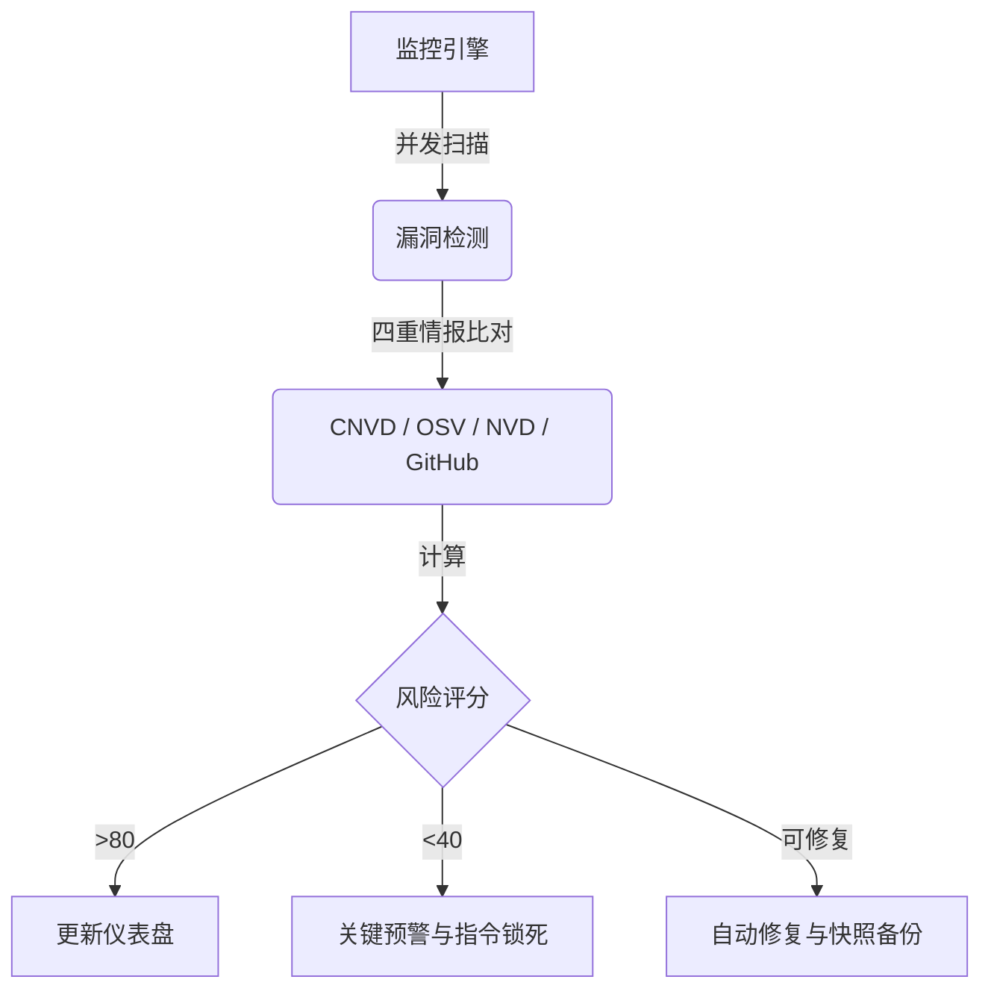

# OpenClaw Guardrails 🛡️

### **多智能体操作系统的智能安全堡垒。**

[](README.md) 
[](#)
[](https://github.com/lttcnly/openclaw-guardrails)
[](#)

---

**OpenClaw Guardrails** 是专为多智能体（Multi-Agent）时代打造的首个 **“自愈式安全框架”**。它不仅仅是发现问题，更能在漏洞被利用前将其 **自动化修复**，为您的 AI 生态系统构建起一道坚固的免疫防线。

---

## 💎 为什么值得关注 (Star) 这个项目？

*   🚀 **极致性能**：基于并发扫描引擎，仅需 17 秒即可完成对整个 OS 的深度审计。
*   🧠 **自愈型 AI**：超越单纯的报告——Guardrails 能 **自动修复** 不安全配置并升级有漏洞的依赖项。
*   💰 **金融级护盾**：唯一能够实时拦截 AI 触发的 **金融转账** 和 **关键系统指令** 并要求人工确认的框架。
*   📡 **全球漏洞情报**：深度集成 **CNVD** (权威漏洞库)、**OSV** 和 **NVD** 全球漏洞库。

---

## 🔥 核心优势

### 🕵️ **1. “四重情报”漏洞管理**
我们的引擎使用四个权威情报源对您的系统执行深度扫描：
-   📡 **CNVD 深度集成**：针对 **CNVD 权威漏洞库** 执行专项审计。
-   🌐 **全球情报互联**：实时对照 **Google OSV**、**NIST NVD** 和 **GitHub 安全顾问库**。
-   **动态发现**：递归解析 `package.json` 和 `requirements.txt` 以发现隐藏的“影子依赖”。

### 🩹 **2. “安全触达”自动修复**
停止手动追踪安全日志。Guardrails 充当您的自动化 SRE：
-   **自动修复 (Auto-Fix)**：瞬间关闭不安全配置，纠正权限过大的策略，并一键升级漏洞包。
-   **快照式备份**：每次修复前都会在 `backups/` 中创建带时间戳的快照，确保随时一键回滚。

### 🛡️ **3. 护盾模式 (实时管控)**
保护您的资产免受 AI 意外或恶意行为的侵害：
-   **金融拦截**：实时拦截 `transfer` (转账)、`pay` (支付) 及 `wallet` (钱包) 操作并要求人工批准。
-   **系统锁死**：在网关层硬性封禁 `rm -rf /` 或 `chmod 777` 等毁灭性指令。

### 📊 **4. 专业级安全看板**
可视化您的风险状况，包括量化风险评分及 10 天风险趋势分析。

---

## 🏗️ 运行逻辑：安全闭环



---

## 🚀 60 秒快速开始

```bash
# 1. 加固您的安装
git clone https://github.com/lttcnly/openclaw-guardrails.git
python3 scripts/install.py

# 2. 开启护盾与深度扫描
./venv/bin/python3 scripts/run_daily.py
```

---
**保护 AI 的未来。与 OpenClaw Guardrails 一起构建。**
